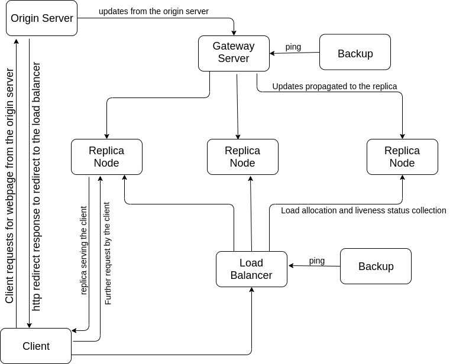

# &nbsp;&nbsp;&nbsp;&nbsp;&nbsp;&nbsp;&nbsp;&nbsp; &nbsp;&nbsp;&nbsp;&nbsp;&nbsp;&nbsp;&nbsp;&nbsp;&nbsp;&nbsp;HTTP CDN

## Group 15
Shashi Ranjan &nbsp;&nbsp;&nbsp;&nbsp;&nbsp;&nbsp;15CS30028 
Himanshu Pareek &nbsp;15CS30016 

### Features 

- <b>Website owner:</b>

``&nbsp;&nbsp;&nbsp;&nbsp;&nbsp;&nbsp;&nbsp;&nbsp;1. Can upload content into the CDN easily.

``&nbsp;&nbsp;&nbsp;&nbsp;&nbsp;&nbsp;&nbsp;&nbsp;2. Can make updates to the content.

- <b>Website Viewer:</b>

``&nbsp;&nbsp;&nbsp;&nbsp;&nbsp;&nbsp;&nbsp;&nbsp;1. Can visit webpages easily as if no CDN is involved.

- <b>System Features :</b> 

``&nbsp;&nbsp;&nbsp;&nbsp;&nbsp;&nbsp;&nbsp;&nbsp;1. Scalibilty

``&nbsp;&nbsp;&nbsp;&nbsp;&nbsp;&nbsp;&nbsp;&nbsp;2. Fault Tolerance

``&nbsp;&nbsp;&nbsp;&nbsp;&nbsp;&nbsp;&nbsp;&nbsp;3. Efficient cache management

``&nbsp;&nbsp;&nbsp;&nbsp;&nbsp;&nbsp;&nbsp;&nbsp;4. Rational Load balancing

### Assumptions : 

1. Synchronous System
2. Reliable Connections
3. All faults are crash faults.

### Major Components :
1. <b>Origin Server :</b> It is the node which hosts the webpage
2. <b>CDN Gateway Server :</b> It is where the webpage owner send all its contents to be ditributed across the CDN
3. <b>CDN Load Balancer Server :</b> It routes all the requests for the content present in the CDN in a way that balances the load across CDN replicas.
4. <b>CDN Replica Servers :</b> They are nodes who actually store and serve the contents of the CDN.
5. <b>Client Node :</b> User who requesting for the content of the CDN.

### Architecture 

### Flow of request/content in our Architecture :

1. Website owner signs up for the CDN service. The content then gets pushed from the orgin server to the gateway node.The origin server also gets hold of the gateway server IP address. So, the gateway server is the point of communication for the origin server for the CDN.

2. ``How does the client(end user) gets served ?  
The client first makes a http request for the page. The DNS record returns ip of the origin server and the request is routed to the origin server. The origin server then returns a http redirection(temporary) as a response. The client then goes to the redirected ip which is the ip of the load balancer. The load balancer then schedules the request to an appropriate replica node based on some scheduling algorithm (round robin, weighted round robin etc.). The replica node then connects with the client and serves the required content.

3. All subsequent client requests are routed directly to the replica server alloted in step2. The replica node continues to serve the client until the cookie given by it to the client expires. In case the cookie expires, client needs to connect to the origin server (this can be detected if the request fetches a "not valid" response from the replica node or a timeout in case of replica fault)

4. How does the replica nodes maintain their caches ?   
Each item present in the cache has a TTL (time to live). When the TTL expires the replica server requests the gateway server for the item and it forwards the request to the origin server. The origin server then sends the required item directly to the replica server without going through the gateway as it knows the ip address of the replica from the forwarded request. This type of update is termed as <b>PULL</b> type update.

5. For critical updates the origin server pushes the update to the gateway server and then it gets broadcasted to concerned replica nodes. This is called a <b>PUSH</b> type update.

6. How to handle gateway fault ?  
 We will maintain a backup of the gateway server. The backup will periodically ping the gateway server and copy current status. In case it detects a crash it will ping the origin server(it can as it copies status of the gateway server periiodically which contains ip of the origin server) and inform it that it is the new gateway server. It then informs all the replica server that it is the new gateway server.

7. How to handle replica fault ?  
It can be easily detected as the load balacer will periodically ping the replica nodes for liveliness. If it detects a crash it will delete the replica from its *current live replicas priority queue*. The clients who were being served by this replica will get a timeout for their request and then they will initiate a connection with origin server for content similar to step2 which gets to load balancer eventually and it will then route the request to a different replica.

8. How to handle load balancer fault ?  
 We will maintain a backup of the load balancer. It will periodically ping the load balancer and will get a copy of the load balancer status. In case it senses a fault, it will first inform the gateway node of the CDN about itself as the new load balancer which inturn will inform the origin server, so that the origin server can now make changes in the http redirection. The new load balancer will then poll the replica server and get their status. For any pending requests from a client it will not wait till it polls all the replicas but will simultaneously allot a replica if it finds during polling that the current load on the replica is less than a threshold.

